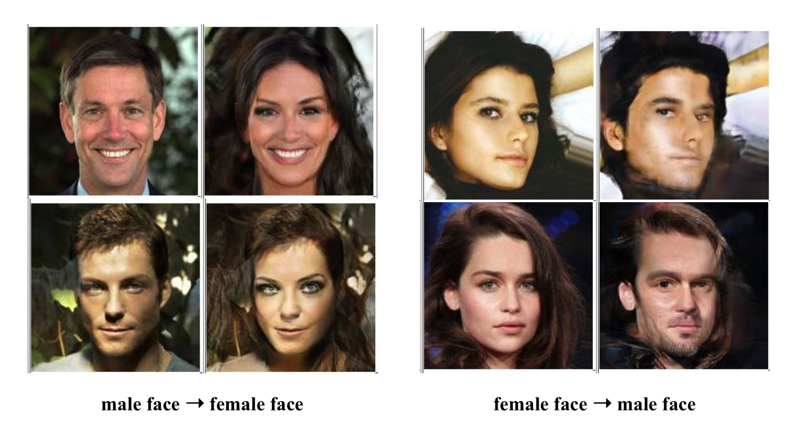
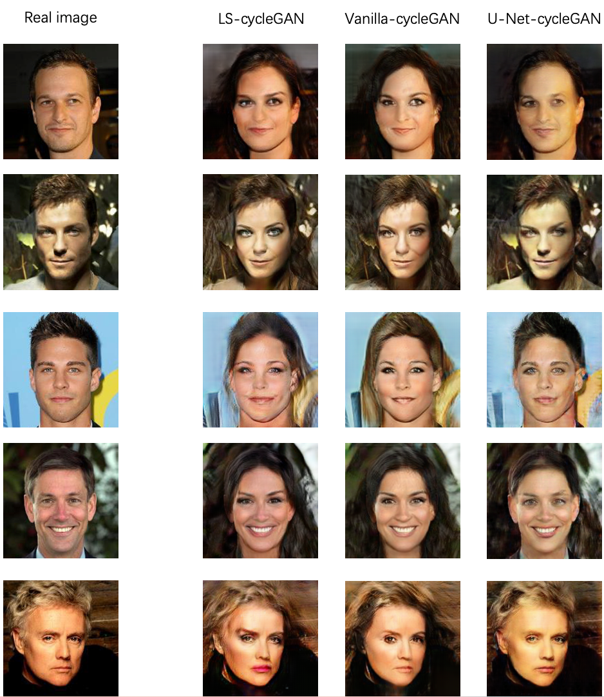
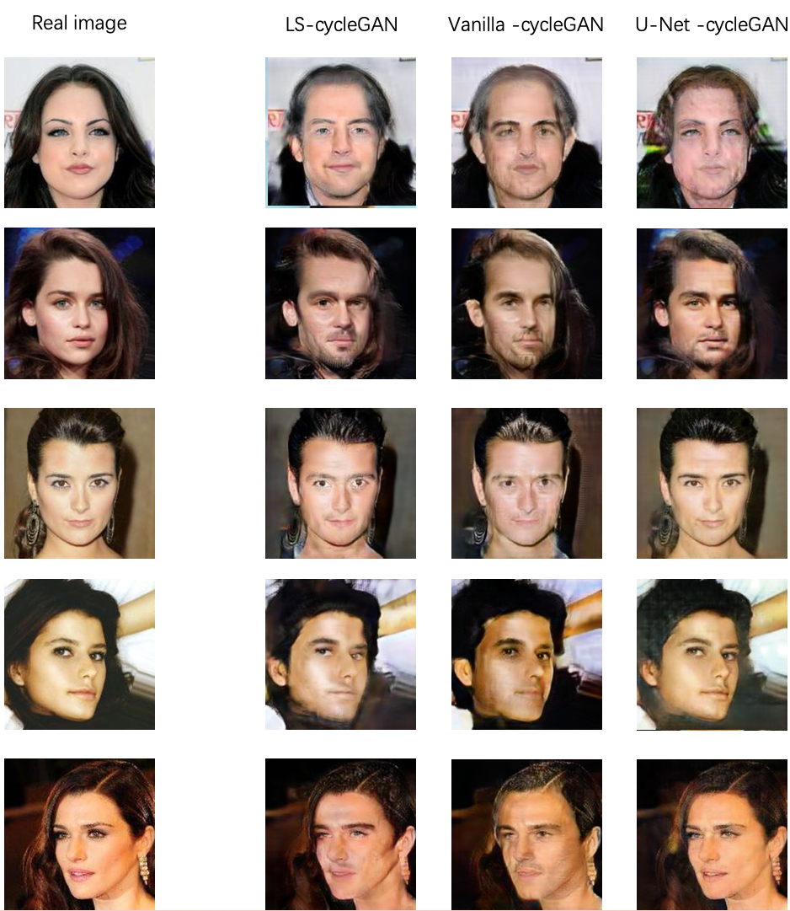
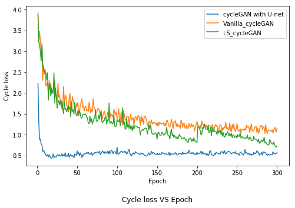
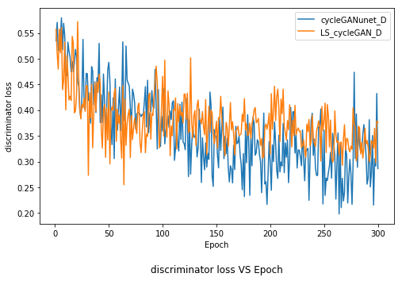
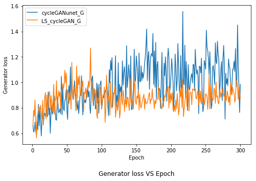
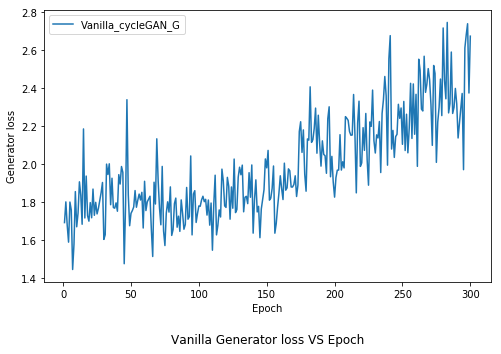

# Transform_face_using_cycleGAN


<br><br><br>


This repo contains the project of [UCSD ECE 228](http://noiselab.ucsd.edu/ECE228/index.html) 2019SP.
We named this project as `Transforming Facial Images Using Generative Adversarial Networks` . It can transform facail image between male and female. 


# Prerequisites
- Python 3.3 or above
- [Pytorch 0.4.0](torch.org)
- [Torchvision](https://github.com/pytorch/vision)
- [visdom visualizer 0.1.8.5](https://github.com/facebookresearch/visdom)
- [dominate 2.3.5](https://github.com/Knio/dominate)


# Quick Start
## Installation

- Clone this repo:
```bash
git clone https://github.com/TengM95/Transform_face_using_cycleGAN
cd Transform_face_using_cycleGAN
```
- Install [PyTorch](http://pytorch.org and) 0.4+ and other dependencies (e.g., torchvision, [visdom](https://github.com/facebookresearch/visdom) and [dominate](https://github.com/Knio/dominate)).
- For pip users, please type the command `pip install -r requirements.txt`.
- For Conda users, we provide a installation script `./scripts/conda_deps.sh`. Alternatively, you can create a new Conda environment using `conda env create -f environment.yml`.

## CycleGAN train/test

The dataset we used is celebrity images from the CelebFaces Attributes Dataset (CelebA).

To train or test a LS-cycleGAN model with downloaded dataset:
```bash
# Training
python train.py  
# Testing
python test.py 
```


<!--# Reproducing test results-->
<!--- Download the weight and test data from [Drive](https://drive.google.com/drive/folders/1x9ud9-8_Ri5vWiHCkBQQsuH3DixHpWuT?usp=sharing).-->
<!--- Place the `checkpoints` folder in the project root path, e.g. the same folder as `test.py`.-->
<!--- Place the `temp_data` folder in anywhere, make sure to change the `config.dataroot = THE_FULL_PATH_TO_TEMP_DATA`, e.g. `config.dataroot = '/home/yuzhe/temp_data'`.-->

# Results



# Training details
Details of the loss of two Discriminator and Generator:






# Acknowledge
- The code of cycleGAN comes from [Jun-Yan Zhu](http://people.csail.mit.edu/junyanz/)
- Dataloader is written by [Phillip Isola](https://phillipi.github.io/pix2pix/)

# Author
Teng Ma, Qingyuan Jin, Isha Srivastava, Jiaqi Yan
